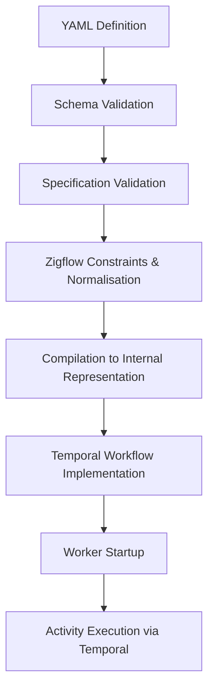

# Zigflow Architecture

Zigflow is an opinionated declarative layer on top of Temporal. It translates
Open Workflow Specification (formerly Serverless Workflow)–style YAML
definitions into executable Temporal workflows, while enforcing
determinism, validation and structural constraints.

This document describes how Zigflow works internally and the architectural
principles that guide its design.

---

## High-level overview

At a conceptual level, Zigflow follows this execution pipeline:

Zigflow handles orchestration. Your services handle the work.

Where possible, Zigflow prevents non-deterministic constructs. In cases where
determinism cannot be guaranteed, Zigflow surfaces explicit validation errors
or warnings.

---

## Core concepts

### Workflow definition

A Zigflow workflow is defined in YAML and includes:

- `dsl` version
- `namespace` (mapped to a Temporal task queue)
- `name` (mapped to a Temporal workflow type)
- `version` (semantic versioning)
- declarative `do` blocks and related constructs

Workflow definitions are treated as data, not code. They are:

- validated before execution
- versionable
- reviewable
- suitable for generation by tooling or UI layers

Zigflow does not embed arbitrary executable code inside workflows.

---

## Validation model

Validation occurs in multiple stages:

1. **Schema validation** – ensures the document conforms to the DSL schema.
2. **Specification validation** – checks alignment with Open Workflow
   Specification constructs.
3. **Zigflow-specific constraints** – enforces rules required for Temporal
   determinism and execution safety.

Invalid definitions are rejected before execution. Zigflow prefers explicit
errors over implicit behaviour.

---

## Compilation model

Zigflow compiles validated workflow definitions into a Temporal workflow
implementation.

Key principles:

- The generated workflow must be deterministic.
- Workflow state transitions are driven by the DSL structure.
- Side effects are modelled as Temporal activities.
- Control flow constructs map to Temporal-safe patterns.

---

## Determinism and Temporal alignment

Temporal workflows must be deterministic. Zigflow enforces this by:

- Disallowing arbitrary runtime code execution inside workflows
- Modelling external interactions as activities
- Ensuring state transitions are derived from declarative definitions
- Avoiding hidden side effects

Where the Open Workflow Specification does not map cleanly to Temporal's
execution model, Zigflow may diverge to preserve correctness and determinism.

Correctness and determinism take priority over strict spec compatibility.

---

## DSL extension mechanism

Zigflow's contract is asymmetric: any workflow valid under the
Open Workflow Specification runs in Zigflow unchanged, and
Zigflow can do more than the spec where Temporal's execution model
or Zigflow's own use cases require it.

Extending the DSL touches four places:

- JSON schema for the new YAML form
- Zigflow Go type for the parsed extension
- Extension struct registered via `extensions.RegisterExtension` that
  decides which bodies to claim
- Task builder that executes the new semantics

During load, the extension's claim runs before the SDK parses the
body. A claimed body has its key renamed from the spec form to a
Zigflow-internal form (prefixed `__zigflow_ext_`), and the SDK
constructs the registered Zigflow type for it. Unclaimed bodies pass
through unchanged with identical Temporal history.

Use an extension when the spec's contract has to change to express a
real Zigflow requirement. Don't use it when `metadata` (the spec's own
extension point) is enough for additive sidecar configuration.
Extensions are a last resort because they widen Zigflow's surface
beyond the spec, and any change should be discussed in advance via an
issue.

---

## Opinionated constraints

Zigflow is intentionally opinionated.

It trades some SDK-level flexibility for:

- Faster development
- Reduced boilerplate
- Structural guardrails
- Predictable execution behaviour

Zigflow does not aim to expose the full surface area of the Temporal SDK.

If your use case depends on advanced SDK-level behaviour, the SDK should be
used directly.

---

## Contribution areas

Contributions are welcome when they align with the architectural goals outlined
above.

Areas where contributions are typically appropriate:

- Additional DSL constructs that map cleanly to Temporal semantics
- Improved validation rules and error messages
- Specification-aligned feature additions
- Performance or execution safety improvements
- Documentation and example enhancements

Changes that affect execution semantics, determinism guarantees or DSL
structure should be discussed in advance via an issue.

Large architectural changes without prior discussion are unlikely to be accepted.

---

## Non-goals

Zigflow is not:

- A generic scripting engine
- A task runner
- A hosted workflow service
- A runtime for arbitrary embedded code

Zigflow is specifically designed as a declarative orchestration layer for Temporal.

---

## Design principles

Zigflow aims to:

- Prefer explicit behaviour over implicit magic
- Preserve determinism at all times
- Maintain backwards compatibility within major versions
- Remain broadly compatible with the Open Workflow Specification where practical
- Optimise for clarity and predictability over feature volume

Opinionation is a feature, not a limitation.

---

## Future evolution

Zigflow continues to evolve alongside Temporal and the Open Workflow
Specification.

New features should:

- Respect Temporal's execution model
- Maintain determinism
- Avoid unnecessary abstraction
- Fit naturally within the existing DSL structure

If you are proposing a change, please open an issue to discuss design
considerations before submitting a pull request.
