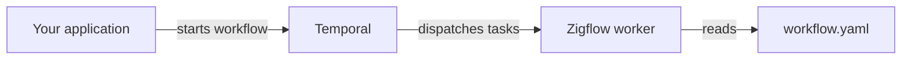

# Overview

## What you will learn

- What Zigflow is and what it does
- How it relates to Temporal
- What Zigflow does not do
- The five-point mental model

---

## What is Zigflow?

Zigflow is a **workflow worker** that reads a YAML file and runs it on
[Temporal](https://temporal.io).

You describe your workflow in YAML. Zigflow validates that description, compiles
it into a Temporal workflow and starts a worker that processes executions.

```yaml title="workflow.yaml"
document:
  dsl: 1.0.0
  taskQueue: zigflow
  workflowType: greet-user
  version: 1.0.0
do:
  - greet:
      set:
        message: Hello from Ziggy
```

Run the worker:

```sh
zigflow run -f workflow.yaml
```

A client application (using any Temporal SDK) then starts an execution against
the `zigflow` task queue with workflow type `greet-user`.

---

## How it relates to Temporal

Temporal is a durable execution platform. It persists workflow state, handles
retries and coordinates workers.

Zigflow sits in front of Temporal as the **worker side**. It:

- Reads your YAML workflow definition
- Validates it before doing anything else
- Registers it with Temporal
- Polls Temporal for executions
- Executes tasks deterministically as Temporal replays the history

Zigflow does not replace Temporal. It requires Temporal to function. You still
need a Temporal server running somewhere.



---

## The mental model

1. A workflow definition is a YAML file, not application code.
2. Zigflow compiles that YAML into a Temporal workflow at startup.
3. The worker polls Temporal for executions. It does not listen on a port.
4. Validation runs before the worker starts. Invalid workflows fail fast.
5. Execution is deterministic. All side effects belong in activities, not
   inline workflow logic.

---

## What Zigflow does not do

Zigflow is a worker and a compiler. It does not:

- Provide a Temporal server (you must supply one)
- Act as an HTTP API for triggering workflows (use a Temporal SDK or the
  Temporal UI)
- Store workflow results (Temporal handles persistence)
- Support all constructs from the CNCF Serverless Workflow specification
  (unsupported features are rejected with a clear error)
- Allow non-deterministic code inside workflow definitions

---

## Common mistakes

**Confusing `document.taskQueue` with the Temporal namespace.**
The `document.taskQueue` field sets the Temporal **task queue** name, not the
Temporal namespace. The Temporal namespace is set at runtime via
`--temporal-namespace`.

**Expecting Zigflow to trigger workflows.**
Zigflow runs the worker. Triggering an execution is done from a Temporal client,
the Temporal CLI or the Temporal UI.

---

## Related pages

- [Temporal prerequisites](/docs/concepts/temporal-prereqs): what you need
  to know about Temporal before using Zigflow
- [How Zigflow runs](/docs/concepts/how-zigflow-runs): the execution model in detail
- [Quickstart](/docs/getting-started/quickstart): install and run a workflow
