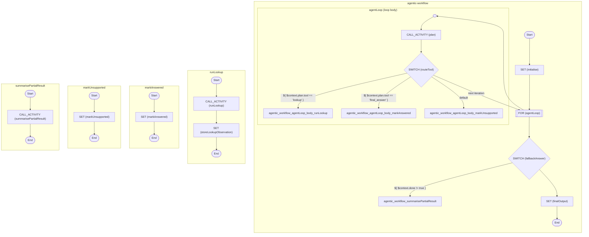

# Agentic Research Assistant

A bounded plan/act/observe loop driven by a local Ollama planner and an
Ollama-backed lookup tool. The point of the example is Zigflow orchestration
of an agent loop, not the accuracy of any particular model.

<!-- toc -->

* [Getting started](#getting-started)
* [What it does](#what-it-does)
* [Example questions](#example-questions)
* [Configuration](#configuration)
* [Sample output](#sample-output)
* [Limitations](#limitations)
* [Diagram](#diagram)

<!-- Regenerate with "pre-commit run -a markdown-toc" -->

<!-- tocstop -->

## Getting started

```sh
docker compose up trigger
```

This starts Temporal, Ollama (pre-pulling `qwen2.5:0.5b`), the Zigflow worker,
the activity worker, and then executes the workflow once and prints the result.

To run the workflow again without restarting the stack:

```sh
docker compose up trigger
```

To ask a different question:

```sh
QUESTION="Who wrote The Hobbit?" docker compose up trigger
```

## What it does

The workflow drives a small ReAct-style loop:

1. `agent.PlanNextStep` calls Ollama to decide the next step. It accepts the
   model's plan only when it parses into a supported tool with non-empty
   arguments; otherwise it falls back deterministically (lookup the question
   on the first iteration, synthesise a final answer thereafter).
2. The result is routed through a `switch` that targets named child
   workflows: `runLookup`, `markAnswered`, or `markUnsupported`.
3. `agent.Lookup` asks Ollama for a one-sentence factual answer to the
   planner-chosen query. The observation is appended to
   `$context.observations`.
4. The for loop's `while` condition checks `$context.done`. When the planner
   returns `final_answer`, `markAnswered` flips `done` to `true` and the loop
   exits on the next iteration.
5. If the loop exhausts `maxIterations` without an answer,
   `agent.SummarisePartialResult` produces a best-effort response.

All inter-iteration state is carried in `$context` so the for loop has a
single, stable carrier. Each named child workflow returns the full updated
agent state, and the switch task's `export` merges it back into `$context`.

## Example questions

The agent handles short factual questions well. A few that exercise the loop
nicely:

* `Who performed Bohemian Rhapsody?`
* `Who was the 1996 Formula 1 world champion?`
* `Who wrote The Hobbit?`
* `What is the capital city of France?`
* `Find the capital city of France, then calculate how many letters are in its name.`

Multi-part questions are where the iterative behaviour shows up most clearly,
because the planner can choose to issue a follow-up `lookup` rather than
answer immediately.

## Configuration

The trigger reads these environment variables:

| Variable         | Default                                                                             | Purpose                                          |
| ---------------- | ----------------------------------------------------------------------------------- | ------------------------------------------------ |
| `QUESTION`       | `Find the capital city of France, then calculate how many letters are in its name.` | The user question fed to the agent.              |
| `MAX_ITERATIONS` | `5`                                                                                 | Upper bound on planner/tool iterations.          |
| `OLLAMA_HOST`    | `http://ollama:11434`                                                               | Where the planner and lookup look for the model. |
| `OLLAMA_MODEL`   | `qwen2.5:0.5b`                                                                      | Ollama model name to use.                        |

## Sample output

Exact answers vary between runs because the model is non-deterministic. The
shape is always the same: a final `answer`, the number of tool calls in
`iterations`, and an array of `observations` showing each lookup the planner
performed.

```json
{
  "answer": "Queen performed Bohemian Rhapsody.",
  "iterations": 1,
  "observations": [
    {
      "tool": "lookup",
      "input": { "query": "Who performed Bohemian Rhapsody?" },
      "output": {
        "answer": "Queen performed Bohemian Rhapsody.",
        "source": "ollama:qwen2.5:0.5b"
      }
    }
  ]
}
```

`iterations` reflects the number of tool calls, not planning rounds.
`markAnswered` does not advance the counter.

## Limitations

* The example is about Zigflow orchestration, not model accuracy. With a
  0.5B-parameter model, expect the planner to sometimes loop on the same
  query and the lookup activity to return confidently wrong answers. Both
  behaviours still exercise the workflow correctly.
* `qwen2.5:0.5b` is chosen so the demo fits on a developer laptop. Swap it
  via `OLLAMA_MODEL` for something larger if you want better answers, e.g.
  `qwen2.5:7b` or `llama3.1:8b`.
* The planner has only two tools (`lookup` and `final_answer`). Adding more
  tools would mean another `then:` branch in the `routeTool` switch and a
  matching activity registration.
* If Ollama is unreachable, the planner falls back to deterministic rules
  (lookup-then-final-answer) and the lookup activity returns an "I am unsure"
  observation. The workflow still completes.
* `then: exit` inside a `for` task only terminates the current iteration's
  task list, not the loop itself. The loop is driven by `while:` against
  `$context.done`, which is the supported pattern.

## Diagram

<!-- ZIGFLOW_GRAPH_START -->

<!-- ZIGFLOW_GRAPH_END -->
