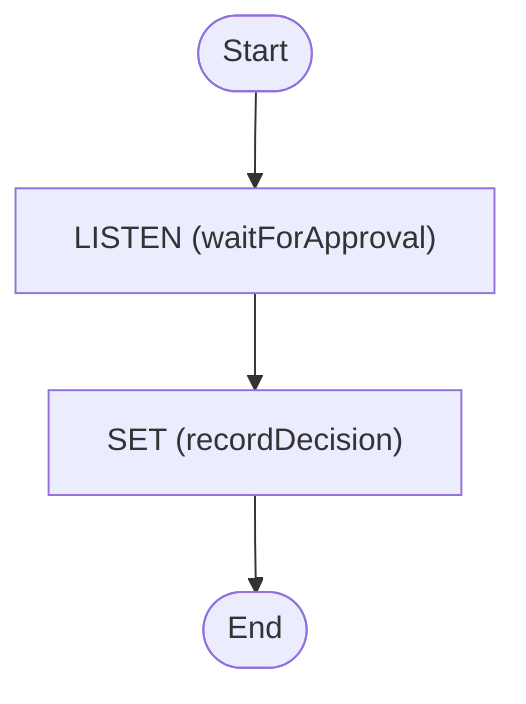

# Approval with Timeout

Wait for a human approval signal, failing fast if it does not arrive in time

<!-- toc -->

* [Getting started](#getting-started)
* [What this shows](#what-this-shows)
* [Diagram](#diagram)

<!-- Regenerate with "pre-commit run -a markdown-toc" -->

<!-- tocstop -->

## Getting started

```sh
go run .
```

This starts the workflow and sends an `approve` signal after a short delay.
Remove that signal to watch the workflow time out instead.

## What this shows

A minimal human-in-the-loop approval gate that cannot block forever. For a
fuller, real-world version that also drives reminders and queries, see
[authorise-change-request](../authorise-change-request).

[workflow.yaml](./workflow.yaml) demonstrates:

* **`listen`** for a Temporal **signal** (`id: approve`) to pause for a human
  decision.
* **`metadata.timeout`** to bound the wait. If no signal arrives in time the
  task fails fast with an explicit timeout error rather than blocking forever.
* Reading the signal payload from **`$data.<taskName>`** (not `$output`).

> **Gotcha:** a signal `listen` only receives signals when it runs at the **top
> level** of the workflow. Putting it inside a `try` or `fork` moves it into a
> child workflow execution, which the parent's signals never reach.

## Diagram

<!-- ZIGFLOW_GRAPH_START -->

<!-- ZIGFLOW_GRAPH_END -->
