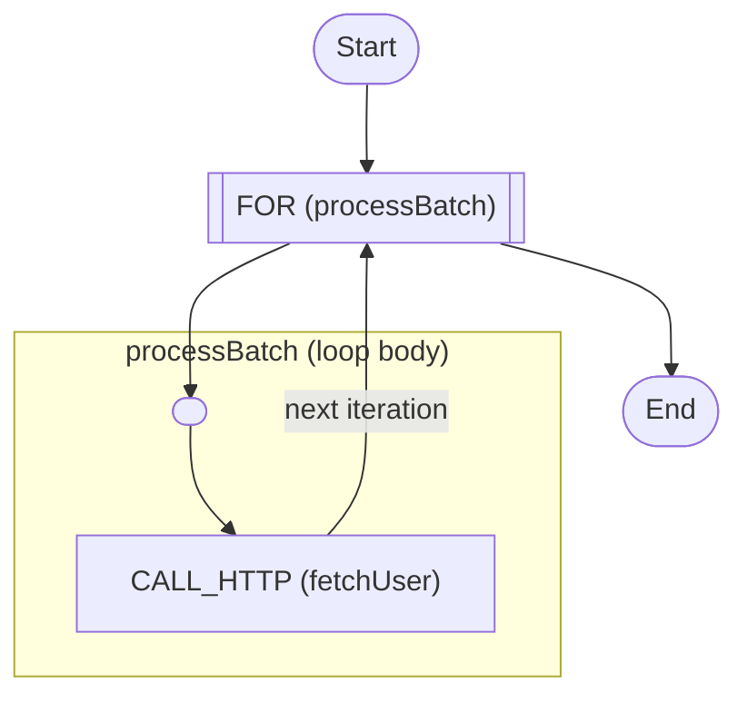

# Batch Processing

Iterate over a collection, call a service per item, and collect the results

<!-- toc -->

* [Getting started](#getting-started)
* [What this shows](#what-this-shows)
* [Diagram](#diagram)

<!-- Regenerate with "pre-commit run -a markdown-toc" -->

<!-- tocstop -->

## Getting started

```sh
go run .
```

This will trigger the workflow and print everything to the console.

## What this shows

Processing a list of items one by one and gathering everything into a single
result.

[workflow.yaml](./workflow.yaml) demonstrates:

* **`for`** iterating an input array, with the current item at `$data.<each>`
  and its position at `$data.<at>`.
* A **`call`** per item, with the per-iteration result shaped by `output.as`.
* **Collecting results**: a `for` task over an array returns an array of each
  iteration's result, so `output.as` on the loop (`${ . }`) gathers the whole
  batch - no manual accumulation required.

For independent work that should run **concurrently** rather than item-by-item,
see [fan-out-fan-in](../fan-out-fan-in).

## Diagram

<!-- ZIGFLOW_GRAPH_START -->

<!-- ZIGFLOW_GRAPH_END -->
