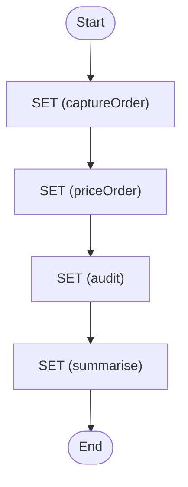

# Data Flow

Demonstrate the difference between output and export ($output vs $context)

<!-- toc -->

* [Getting started](#getting-started)
* [What this shows](#what-this-shows)
* [Diagram](#diagram)

<!-- Regenerate with "pre-commit run -a markdown-toc" -->

<!-- tocstop -->

## Getting started

```sh
go run .
```

This will trigger the workflow and print everything to the console.

## What this shows

Zigflow has two separate data channels and mixing them up is the most common
authoring mistake:

* **`$output`** is the result of the **latest task only**. Each task replaces
  it. The workflow returns the final task's `$output`.
* **`$context`** is **shared state** that persists for the whole workflow. It is
  only changed by `export`.

Key idioms demonstrated in [workflow.yaml](./workflow.yaml):

* `export.as` persists values to `$context` so non-adjacent tasks can read them.
* `export` **replaces** `$context` wholesale, so merge with
  `${ $context + { ... } }` to accumulate rather than overwrite.
* `output.as` shapes a single task's result; an intervening task (`audit`)
  overwrites `$output`, but `$context` survives.
* The final task rebuilds the workflow result from `$context`.

## Diagram

<!-- ZIGFLOW_GRAPH_START -->

<!-- ZIGFLOW_GRAPH_END -->
