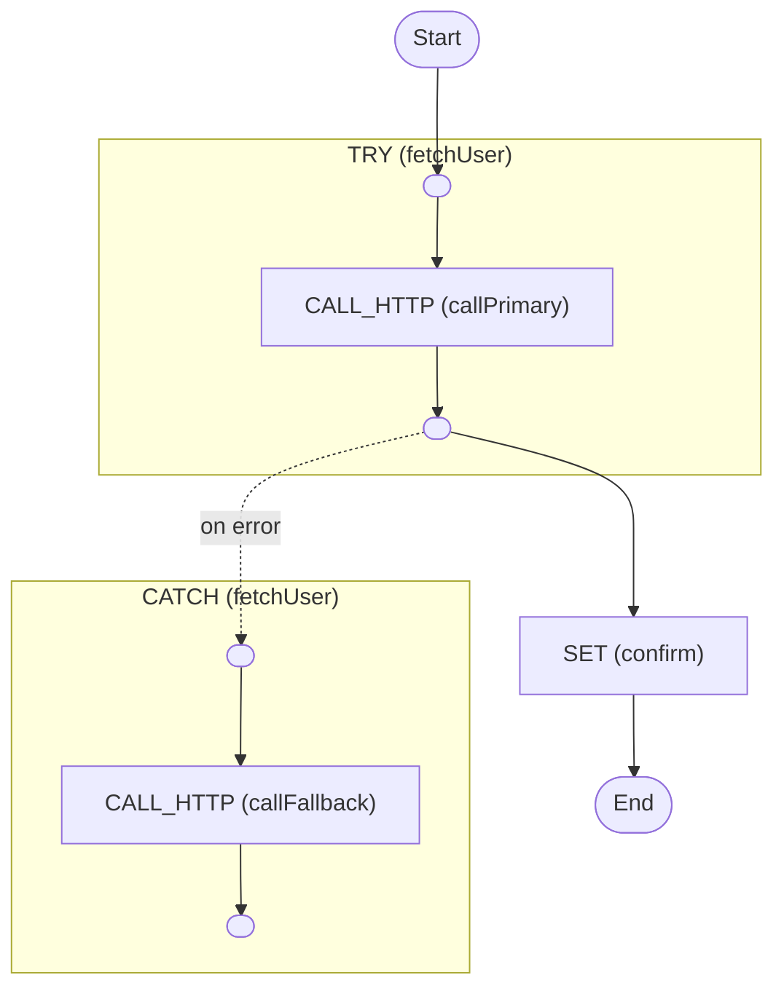

# Error Fallback

Retry a failing call, then recover with a fallback so the workflow succeeds

<!-- toc -->

* [Getting started](#getting-started)
* [What this shows](#what-this-shows)
* [Diagram](#diagram)

<!-- Regenerate with "pre-commit run -a markdown-toc" -->

<!-- tocstop -->

## Getting started

```sh
go run .
```

This will trigger the workflow and print everything to the console.

## What this shows

Catching an error is only half the story - this example shows how to *recover*
from one so the workflow still completes successfully.

[workflow.yaml](./workflow.yaml) demonstrates:

* **`retryPolicy`** (`metadata.activityOptions.retryPolicy.maximumAttempts`) on
  the primary call. The `catch` block runs **only after** every attempt has
  failed, not on the first failure.
* **`try` / `catch`** where the `catch` does real work: it calls a **backup
  service** instead of just recording the error.
* **Continuation** - the workflow carries on past the recovered error, reading
  the result of whichever call succeeded (primary or fallback) from `$output`.

The result reports a `source` of `primary` when the first call works and
`fallback` when the backup is used.

## Diagram

<!-- ZIGFLOW_GRAPH_START -->

<!-- ZIGFLOW_GRAPH_END -->
