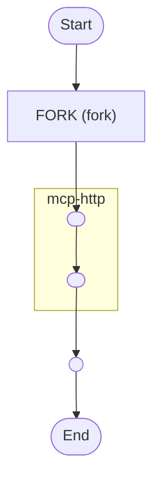

# External Calls Workflow

An example of how to make external calls with Zigflow

<!-- toc -->

* [Getting started](#getting-started)
* [Diagram](#diagram)

<!-- Regenerate with "pre-commit run -a markdown-toc" -->

<!-- tocstop -->

## Getting started

Generate the protobuf definition

```sh
task -d ../../ generate-grpc
```

Now run the application

```sh
docker compose up starter
```

This will trigger the workflow with some input data and print everything to the
console.

## Diagram

<!-- ZIGFLOW_GRAPH_START -->

<!-- ZIGFLOW_GRAPH_END -->
