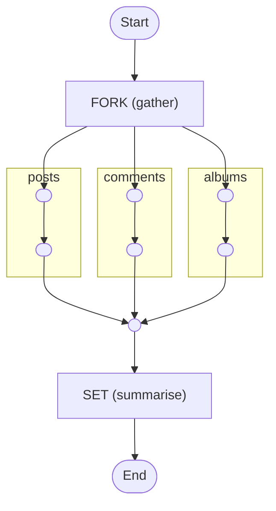

# Fan-out / Fan-in

Run branches concurrently then aggregate their results (scatter/gather)

<!-- toc -->

* [Getting started](#getting-started)
* [What this shows](#what-this-shows)
* [Diagram](#diagram)

<!-- Regenerate with "pre-commit run -a markdown-toc" -->

<!-- tocstop -->

## Getting started

```sh
go run .
```

This will trigger the workflow and print everything to the console.

## What this shows

The classic scatter/gather pattern: do independent work in parallel, then
combine the results.

[workflow.yaml](./workflow.yaml) demonstrates:

* **Fan-out** with `fork` and `compete: false` (the default) so **every** branch
  runs concurrently to completion - unlike `compete: true`, which keeps only the
  first to finish (see [competing-concurrent-tasks](../competing-concurrent-tasks)).
* Branch results are collected into a single object **keyed by branch name**.
* **Fan-in** with `export` to `$context` followed by an aggregation task that
  iterates `$context.counts[]`, so it works for any number of branches without
  hard-coding each one.

## Diagram

<!-- ZIGFLOW_GRAPH_START -->

<!-- ZIGFLOW_GRAPH_END -->
