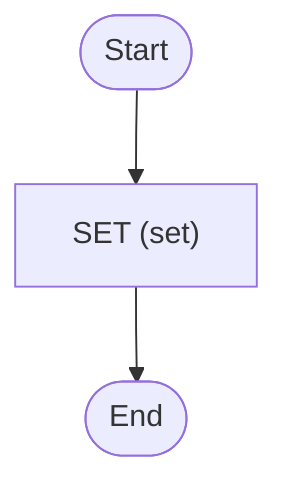

# Hello World with Redis External Storage

Hello world with Zigflow, but with the payloads stored in Redis

This example demonstrates the Claim Check pattern. Both the worker and the
trigger set a payload size threshold of 1, so every payload is offloaded to a
local Redis server and only a reference passes through Temporal. For the
configuration reference, see
[External storage](https://zigflow.dev/docs/deployment/external-storage).

<!-- toc -->

* [Getting started](#getting-started)
* [Diagram](#diagram)

<!-- Regenerate with "pre-commit run -a markdown-toc" -->

<!-- tocstop -->

## Getting started

In one terminal, run:

```sh
docker compose up workflow
```

In another terminal, run:

```sh
docker compose up trigger
```

This will trigger the workflow and print everything to the console. When you
look in the [Temporal UI](http://localhost:8080), the history holds references
rather than values. Because the threshold is set to 1 on both the worker and
the trigger, every payload goes to Redis instead of being sent to the Temporal
server. Without the threshold the hello world payload would be far too small
to be offloaded, so the behaviour would not be visible.

The stack also runs [Redis Commander](http://localhost:8081), which you can
use to inspect what was stored. The offloaded payloads are held under the
`zigflow:claim:` key prefix, one key per reference in the workflow history.

The Redis container has no volume and no persistence configured, so its
contents are discarded when you run `docker compose down`. That is a
convenience of this throwaway stack rather than anything the external storage
mechanism does: offloaded payloads have no managed lifecycle, so a real
deployment needs to decide its own retention and eviction behaviour. See
[Operational considerations](https://zigflow.dev/docs/deployment/external-storage#operational-considerations).

## Diagram

<!-- ZIGFLOW_GRAPH_START -->

<!-- ZIGFLOW_GRAPH_END -->
