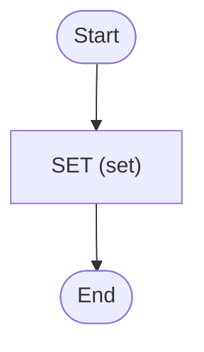

# Hello World External Storage

Hello world with Zigflow, but with the data stored externally

<!-- toc -->

* [Getting started](#getting-started)
* [Diagram](#diagram)

<!-- Regenerate with "pre-commit run -a markdown-toc" -->

<!-- tocstop -->

## Getting started

In one terminal, run:

```sh
docker compose up workflow
```

In another terminal, run:

```sh
docker compose up trigger
```

This will trigger the workflow and print everything to the console. When you look
in the [Temporal UI](http://localhost:8080), all the data will be stored in the
local S3 store meaning your data is never sent to the Temporal server.

## Diagram

<!-- ZIGFLOW_GRAPH_START -->

<!-- ZIGFLOW_GRAPH_END -->
