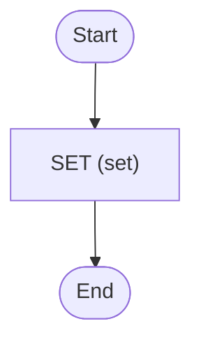

# Hello World

Hello world with Zigflow

<!-- toc -->

* [Getting started](#getting-started)
* [Diagram](#diagram)

<!-- Regenerate with "pre-commit run -a markdown-toc" -->

<!-- tocstop -->

## Getting started

```sh
go run .
```

This will trigger the workflow and print everything to the console.

With a local Temporal server (`temporal server start-dev`):

```sh
go run . test workflow.yaml --input test-input.json
```

See [Using the CLI](/docs/cli/using-the-cli) for `zigflow test` behaviour.

## Diagram

<!-- ZIGFLOW_GRAPH_START -->

<!-- ZIGFLOW_GRAPH_END -->
