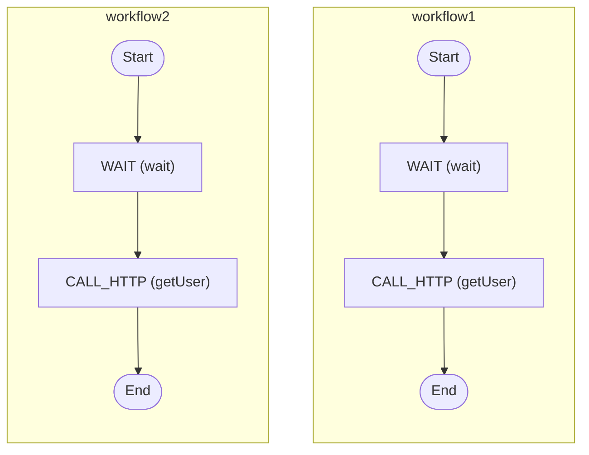

# Multiple Workflows

Configure multiple workflows

<!-- toc -->

* [Getting started](#getting-started)
* [Diagram](#diagram)

<!-- Regenerate with "pre-commit run -a markdown-toc" -->

<!-- tocstop -->

## Getting started

```sh
go run .
```

This example defines multiple workflow types within a single Zigflow
definition. Each workflow is registered independently and can be started
separately.

In this case:

* `workflow1` and `workflow2` are both defined in the same YAML file
* both are registered on the same worker
* each can be executed independently using its own workflow name

This is useful when:

* workflows are closely related and you want to keep them together
* you want to share configuration, environment variables, or activities
* you prefer a single deployment unit rather than multiple files

> This differs from the [Multiple Workflow Files](../multiple-workflow-files/)
> example, which loads multiple YAML files into a single Zigflow process. Here,
> everything is defined in one file.

This will trigger one of the workflows with some input data and print
everything to the console.

## Diagram

<!-- ZIGFLOW_GRAPH_START -->

<!-- ZIGFLOW_GRAPH_END -->
