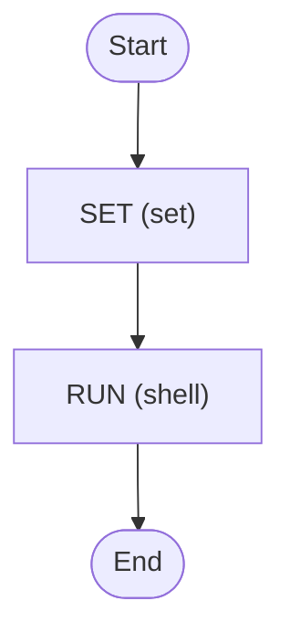

# Priority and Fairness

Using Temporal's Priority and Fairness features with Zigflow

<!-- toc -->

* [Priority design](#priority-design)
* [Getting started](#getting-started)
* [Diagram](#diagram)

<!-- Regenerate with "pre-commit run -a markdown-toc" -->

<!-- tocstop -->

> [!IMPORTANT]
> Temporal Priority & Fairness depends on server-side feature flags
> (`matching.useNewMatcher`, `matching.enableFairness`, `matching.enableMigration`).
> Zigflow enables these by default; if you're running a custom Temporal setup,
> you must configure them yourself. See [Temporal docs](https://docs.temporal.io/develop/task-queue-priority-fairness).
> for details.
>
> ⚠️ Fairness is a chargeable feature in Temporal Cloud.

## Priority design

The demo uses two Temporal priority lanes:

* a higher-priority lane for urgent work
* a shared lower-priority lane where throughput is split using fairness

| Group | Priority lane | Fairness key            | Weight | Behaviour                              |
|-------|---------------|-------------------------|--------|----------------------------------------|
| 1     | 1 (urgent)    | group-1-mission-critical| 1      | Scheduled ahead of non-urgent work     |
| 2     | 2 (shared)    | group-2-paid            | 8      | Highest throughput in shared lane      |
| 3     | 2 (shared)    | group-3-standard        | 4      | Lower throughput than Group 2          |
| 4     | 2 (shared)    | group-4-hobby           | 2      | Lower throughput than Group 3          |
| 5     | 2 (shared)    | group-5-free            | 1      | Lowest throughput in shared lane       |

Group 1 uses `priorityKey=1`, so it is scheduled ahead of all work in the
lower-priority lane.

Groups 2–5 share `priorityKey=2`, forming a common lane. Within that lane,
each group has its own `fairnessKey` and weight. The weights (8, 4, 2, 1)
control how available capacity is divided between groups under load, with
higher-tier groups receiving a larger share.

This means higher-tier groups complete more work over time, while lower-tier
groups still make visible progress.

## Getting started

```sh
go run .
```

This will trigger the workflow and print everything to the console.

## Diagram

<!-- ZIGFLOW_GRAPH_START -->

<!-- ZIGFLOW_GRAPH_END -->
