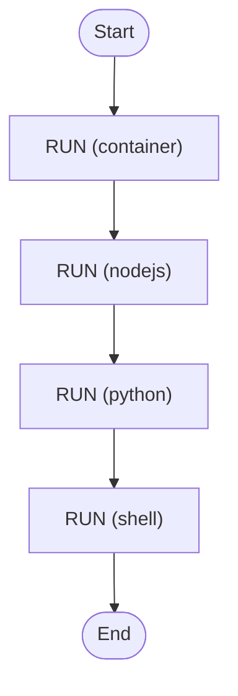

# Run Container Task on Kubernetes

Run a `run.container` task using the Kubernetes runtime instead of Docker.

The worker is deployed into a local minikube cluster via Helm and Skaffold.
When the workflow runs, the worker creates a Kubernetes Job in its own
namespace, waits for the Job to complete, captures the pod's stdout and
returns it as the workflow result.

<!-- toc -->

* [Prerequisites](#prerequisites)
* [How it works](#how-it-works)
* [Getting started](#getting-started)
* [Trigger the workflow](#trigger-the-workflow)
* [Cleanup](#cleanup)
* [Troubleshooting](#troubleshooting)
* [Diagram](#diagram)

<!-- Regenerate with "pre-commit run -a markdown-toc" -->

<!-- tocstop -->

## Prerequisites

* [minikube](https://minikube.sigs.k8s.io/) running locally (`minikube start`)
* [Skaffold](https://skaffold.dev/)
* `kubectl` pointed at the minikube context
* A Temporal server reachable from inside the cluster at
  `temporal.temporal.svc.cluster.local:7233`. The simplest way is the
  community [Temporal Helm chart](https://github.com/temporalio/helm-charts)
  in a namespace called `temporal`.

This example does not require Temporal Cloud, a kubeconfig inside the worker,
a host Docker socket mount or privileged pods.

## How it works

* `skaffold dev -p run-task` builds the Zigflow image locally and deploys the
  `charts/zigflow` Helm chart into minikube under the `zigflow` namespace.
* The chart's `values.yaml` defaults `container-runtime: kubernetes`, so the
  deployed worker runs `zigflow run --container-runtime=kubernetes ...`.
* The chart's deployment template injects `CONTAINER_RUNTIME_NAMESPACE` from
  the downward API and `CONTAINER_RUNTIME_SERVICE_ACCOUNT` from the chart's
  workload ServiceAccount name. Zigflow picks these up via viper's
  `AutomaticEnv` so the worker creates Jobs in its own namespace, running
  under a separate workload identity.
* Two ServiceAccounts are created: one for the worker (with RBAC to manage
  Jobs and read pod logs) and one for workload pods (no RBAC, automount
  disabled). This stops workflow-defined containers from inheriting the
  worker's control-plane permissions.
* The chart's `Role` and `RoleBinding` (see
  [charts/zigflow/templates/role.yaml](../../charts/zigflow/templates/role.yaml))
  grant exactly the verbs the runtime needs:
  `batch/jobs` create/get/list/watch/delete and `pods` + `pods/log` read.
  The binding subjects the worker ServiceAccount only; the workload
  ServiceAccount is intentionally left unbound.
* `workflow.yaml` is mounted into the worker via Helm's `--set-file` so the
  workflow definition is loaded the moment the worker starts.
* Skaffold port-forwards the in-cluster Temporal service to
  `localhost:7080`; `main.go` connects there to trigger the workflow.

## Getting started

From the repository root:

```sh
skaffold dev -p run-task
```

Skaffold builds the worker image, loads it into minikube, deploys the chart
and tails logs. Leave it running.

Verify the worker pod is up:

```sh
kubectl -n zigflow get pods
```

You should see a pod like `zigflow-...` in `Running` state.

## Trigger the workflow

In a second terminal, with `skaffold dev` still running, trigger the
workflow against the port-forwarded Temporal:

```sh
cd examples/run-task-kubernetes
TEMPORAL_ADDRESS=localhost:7080 go run .
```

The trigger waits for the workflow to complete and prints the result.

While the workflow is running you can watch the Job that the worker creates:

```sh
kubectl -n zigflow get jobs -w
```

You will see a `zigflow-run-task-...` Job appear, run to completion and be
deleted (because the example's container lifetime defaults to `always`).

The workflow result is the captured pod stdout, which for this example is
the output of `env`. You should see `HELLO=world` plus the standard
Kubernetes-injected environment variables, confirming the work ran inside a
Kubernetes Job and not on the worker pod itself.

## Cleanup

Press `Ctrl+C` in the terminal running `skaffold dev`. Skaffold tears down
the Helm release and removes the worker pod automatically.

If a workflow run created Jobs that for some reason were not deleted (for
example you set `lifetime.cleanup: never` while experimenting), clean them
up manually:

```sh
kubectl -n zigflow delete jobs -l app.kubernetes.io/name=zigflow
```

The whole `zigflow` namespace can be removed with:

```sh
kubectl delete namespace zigflow
```

The `temporal` namespace, if you installed Temporal via Helm, is not part of
this example. Remove it separately if you no longer need it.

## Troubleshooting

**`skaffold dev` cannot connect to a cluster.**
Check `kubectl config current-context` returns `minikube`, and that
`minikube status` reports it as `Running`.

**`error: kubectl context "minikube" not found`.**
Run `minikube start`. Skaffold activates the `minikube` profile based on the
current kube context, so it will not deploy if you are pointed at a
different cluster.

**Worker pod stuck in `ImagePullBackOff`.**
The Helm chart sets `image.pullPolicy: Never` so minikube must already have
the image built by Skaffold. Make sure `skaffold dev` is the command being
run (not `skaffold deploy` or a stale `kubectl apply`). If you ran out of
disk in minikube, `minikube ssh -- docker image ls` will tell you whether
the image is there.

**Job created but pods missing logs.**
Logs are read from the first pod matching the run's `zigflow.dev/runId` and
`zigflow.dev/activityId` labels. If the Job's pod was deleted before logs
were collected (for example a node restart, or `lifetime.cleanup: always`
firing prematurely), `error retrieving job logs: no pods found for job`
appears in the worker log. Re-run the workflow; this is transient.

**Worker logs: `forbidden: cannot create resource jobs`.**
The RBAC `RoleBinding` was not applied. Check
`kubectl -n zigflow get rolebinding,role` shows both objects. A fresh
`skaffold dev -p run-task` re-applies them.

**Worker cannot reach Temporal.**
The chart's `temporal-address` is set in [skaffold.yaml](../../skaffold.yaml) to
`temporal.temporal.svc.cluster.local:7233`. Confirm Temporal is running in a
`temporal` namespace and reachable on port 7233:

```sh
kubectl -n temporal get svc temporal
```

**Trigger fails with `connection refused` to `localhost:7080`.**
Skaffold creates the port-forward when `skaffold dev` starts. If you ran
the trigger before Skaffold finished bringing up Temporal's service, retry
after a few seconds.

## Diagram

<!-- ZIGFLOW_GRAPH_START -->

<!-- ZIGFLOW_GRAPH_END -->
