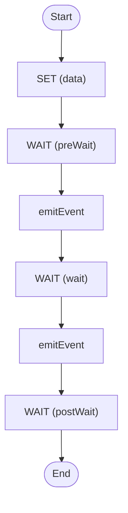

# Workflow Streams

Stream data back from a workflow

<!-- toc -->

* [Getting started](#getting-started)
* [Diagram](#diagram)

<!-- Regenerate with "pre-commit run -a markdown-toc" -->

<!-- tocstop -->

## Getting started

```sh
go run .
```

This triggers the workflow, subscribes to its `topic1` and `topic2` Workflow
Stream topics, prints each item as it arrives, then prints the workflow result.
The `topic1` item includes an `id` generated by the workflow and populated
through a runtime expression.

## Diagram

<!-- ZIGFLOW_GRAPH_START -->

<!-- ZIGFLOW_GRAPH_END -->
