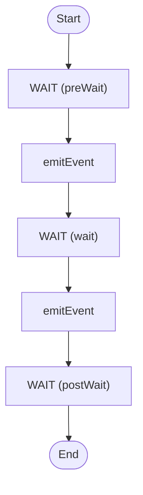

# Workflow Streams

Stream data back from a workflow

<!-- toc -->

* [Getting started](#getting-started)
* [Diagram](#diagram)

<!-- Regenerate with "pre-commit run -a markdown-toc" -->

<!-- tocstop -->

## Getting started

```sh
go run .
```

This triggers the workflow with a `sendAt` set 10 seconds in the future and a
2-second `cancelGraceSeconds`, then prints the resulting payload.

## Diagram

<!-- ZIGFLOW_GRAPH_START -->

<!-- ZIGFLOW_GRAPH_END -->
